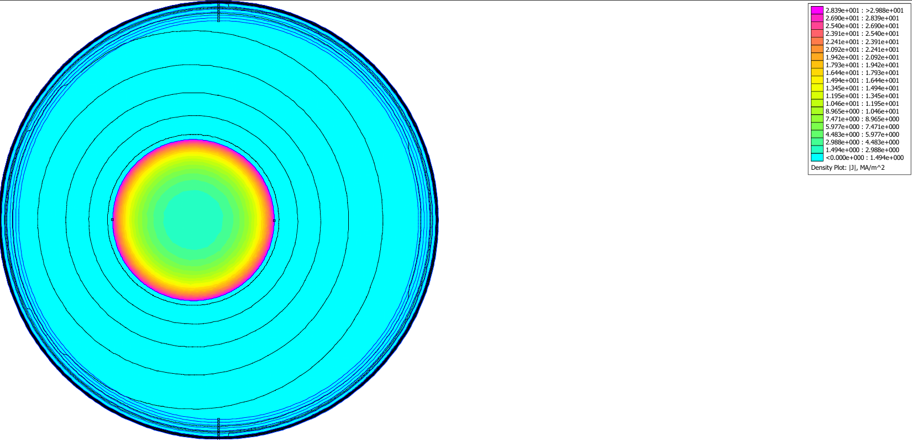
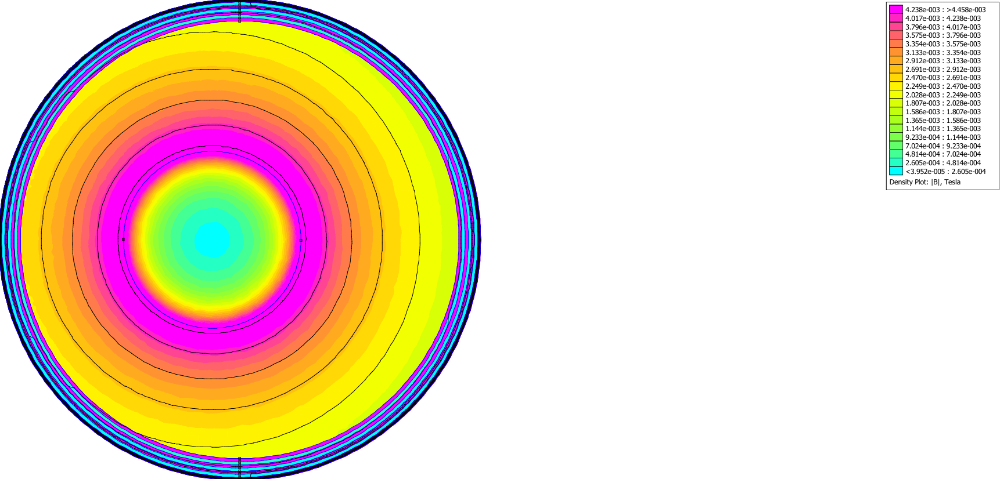
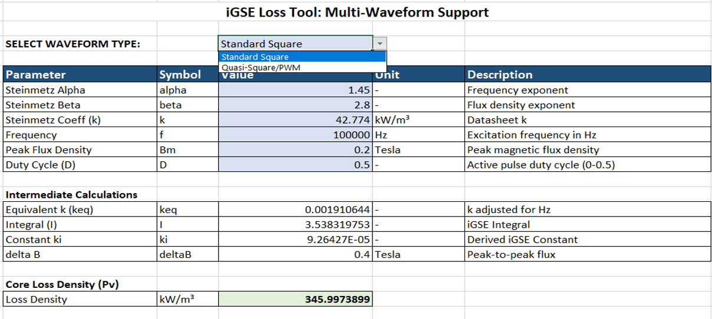
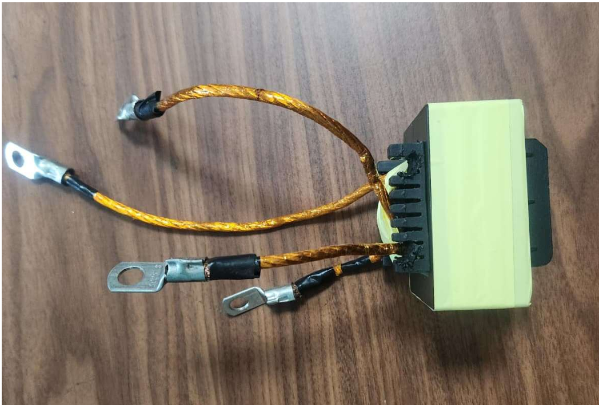
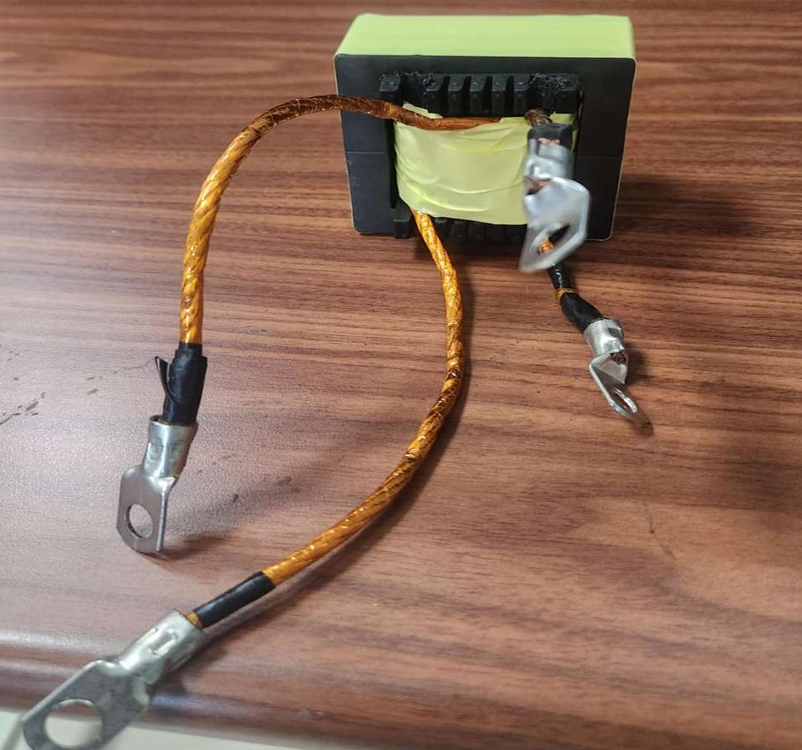

# High-Frequency Transformer Design and Core-Loss Modelling for Dual Active Bridge Converters

## Overview

This repository presents the complete design, analysis, and development of a High-Frequency Transformer (HFT) for Dual Active Bridge (DAB) converter applications. The project focuses on magnetic component design for high-frequency power conversion, including core selection, winding design, high-frequency conductor analysis, core-loss modelling, and hardware prototype development.

The work combines analytical design techniques, finite-element analysis using FEMM, Improved Generalized Steinmetz Equation (iGSE) based core-loss modelling, Excel-based design automation, and practical hardware implementation.

Unlike conventional transformer design approaches, this project investigates the impact of non-sinusoidal excitation waveforms and high-frequency effects encountered in modern power electronic converters.

---

## Project Objectives

* Design a High-Frequency Transformer for DAB converter applications.
* Select an appropriate ferrite core for 100 kHz operation.
* Determine transformer turns ratio and winding configuration.
* Investigate high-frequency current distribution effects.
* Compare solid conductors and Litz wire using FEMM simulations.
* Model core losses under square-wave and quasi-square-wave excitation using iGSE.
* Develop an Excel-based core-loss prediction tool.
* Fabricate a hardware prototype for future validation.

---

## Design Specifications

| Parameter              | Value       |
| ---------------------- | ----------- |
| Rated Power            | 25 kW       |
| Switching Frequency    | 100 kHz     |
| Input Voltage          | 180–270 V   |
| Nominal Input Voltage  | 240 V       |
| Output Voltage         | 300–420 V   |
| Nominal Output Voltage | 360 V       |
| Core Material          | N87 Ferrite |
| Core Type              | EE65        |

---

## Design Workflow

```text
DAB Converter Specifications
           ↓
Area Product Method
           ↓
Core Selection
           ↓
Turns Calculation
           ↓
High-Frequency Winding Design
           ↓
FEMM Analysis
           ↓
Core-Loss Modelling (iGSE)
           ↓
Excel Automation Tool
           ↓
Hardware Prototype Development
```

---

## Skills Demonstrated

* High-Frequency Transformer Design
* Magnetic Component Design
* Ferrite Core Selection
* Area Product Method
* Winding Design
* Skin-Effect Analysis
* Litz-Wire Design
* FEMM
* Core-Loss Modelling
* Steinmetz Equation
* Improved Generalized Steinmetz Equation (iGSE)
* Power Electronics
* Hardware Development

---

## Transformer Design Methodology

The transformer was designed using the Area Product Method to satisfy the power handling and frequency requirements of the DAB converter.

The design process included:

* Core selection
* Turns calculation
* Winding design
* Current density considerations
* High-frequency conductor selection
* Core-loss estimation

Detailed calculations and derivations are provided in the project report.

---

## Core Selection and Area Product Method

The EE65 ferrite core was selected based on area-product calculations and high-frequency operating requirements.

The selected N87 ferrite material provides:

* Low core losses at 100 kHz
* High magnetic permeability
* Good thermal performance
* Suitability for high-frequency power conversion applications

Detailed area-product calculations are included in the project documentation.

---

## High-Frequency Conductor Analysis using FEMM

At high frequencies, conductor current distribution becomes non-uniform due to the skin effect and proximity effect. FEMM simulations were performed to investigate these phenomena and justify conductor selection.

### Solid Conductor Current Distribution



### Litz Wire Current Distribution

_J_distribution.png)

### Solid Conductor Flux Distribution



### Litz Wire Flux Distribution

_B_distribution.png)

### Key Observations

- Significant current crowding was observed in the solid conductor.
- Current distribution in the Litz-wire conductor was substantially more uniform.
- Effective conductor utilization improved using Litz wire.
- High-frequency copper losses were reduced through strand-based winding design.
- FEMM results validated the selection of Litz wire for high-frequency transformer windings.

## Core-Loss Modelling using iGSE

Core losses were modelled using the Improved Generalized Steinmetz Equation (iGSE).

The iGSE methodology was selected because conventional Steinmetz equations are primarily applicable to sinusoidal excitation, whereas DAB converters operate using non-sinusoidal waveforms.

The developed methodology supports:

* Sinusoidal excitation
* Square-wave excitation
* Quasi-square-wave excitation

This approach enables more accurate prediction of ferrite core losses under practical converter operating conditions.

---

## Excel-Based Core-Loss Calculator

An Excel-based design tool was developed to automate core-loss calculations using the iGSE methodology.

### Features

* Steinmetz parameter implementation
* Square-wave loss calculation
* Quasi-square-wave loss calculation
* Frequency-dependent analysis
* Duty-cycle variation support
* Automated loss estimation



---

## Hardware Prototype

A hardware prototype of the designed high-frequency transformer was fabricated using the selected EE65 ferrite core and winding configuration.

### Prototype Assembly





The fabricated transformer serves as a platform for future experimental validation of analytical and simulation results.

---

## Project Documentation

### Available Documents

* Final Project Report
* Design Calculations
* FEMM Analysis Results
* Core-Loss Modelling Methodology
* Hardware Development Documentation

---

## Project Outcomes

* Designed a 25 kW High-Frequency Transformer for DAB converter applications.
* Selected an EE65 ferrite core using the Area Product Method.
* Performed high-frequency conductor analysis using FEMM.
* Evaluated current-density distribution in solid and Litz-wire conductors.
* Developed an iGSE-based core-loss modelling methodology.
* Created an Excel-based core-loss prediction tool.
* Fabricated a hardware prototype for future validation.

---

## Future Work

* Experimental validation of core-loss predictions.
* Open-circuit and short-circuit testing.
* Thermal characterization of the transformer.
* Efficiency analysis under load conditions.
* Integration with a complete DAB converter system.

---

## Author

Sharath Kumar
B.Tech Electrical Engineering
Indian Institute of Technology Bhubaneswar

Project: High-Frequency Transformer Design and Core-Loss Modelling for Dual Active Bridge Converters
